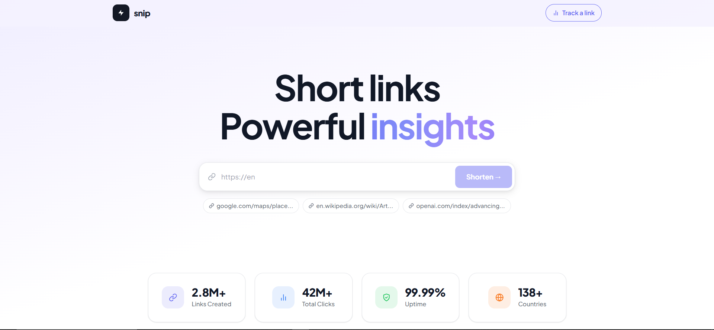
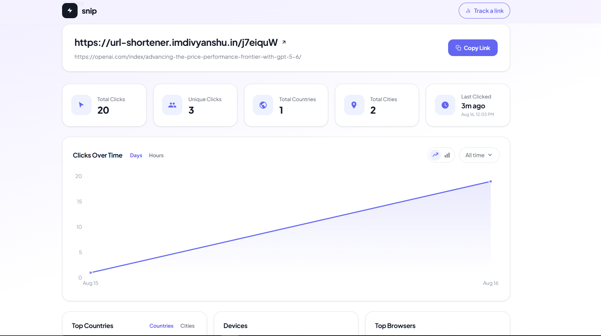

# URL Shortener

A fast, minimal URL shortener with click analytics. Paste a long URL, get a short one, and track who clicked it.

---

**Demo**

[app.webm](https://github.com/user-attachments/assets/8fa95e97-3497-4bca-bd36-2d52b51f414c)

---

**Home**

---

**Analytics**

Tracks total clicks, unique visitors, clicks by country/city, device, browser, OS, and click trends by day and hour.
