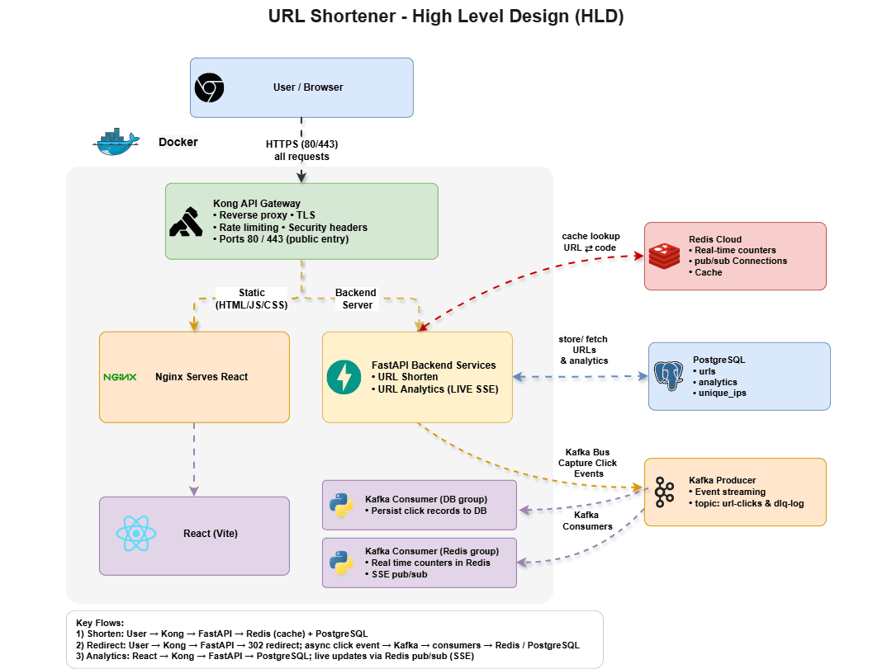

# URL Shortener

A fast, minimal URL shortener with click analytics. Paste a long URL, get a short one, and track who clicked it.

**Architecture**

**Video**

[video.webm](https://github.com/user-attachments/assets/f9d25fce-20dc-4ea4-9171-508fcadb8051)

**Home**

**Analytics**

Tracks total clicks, unique visitors, clicks by country/city, device, browser, OS, and click trends by day and hour.
